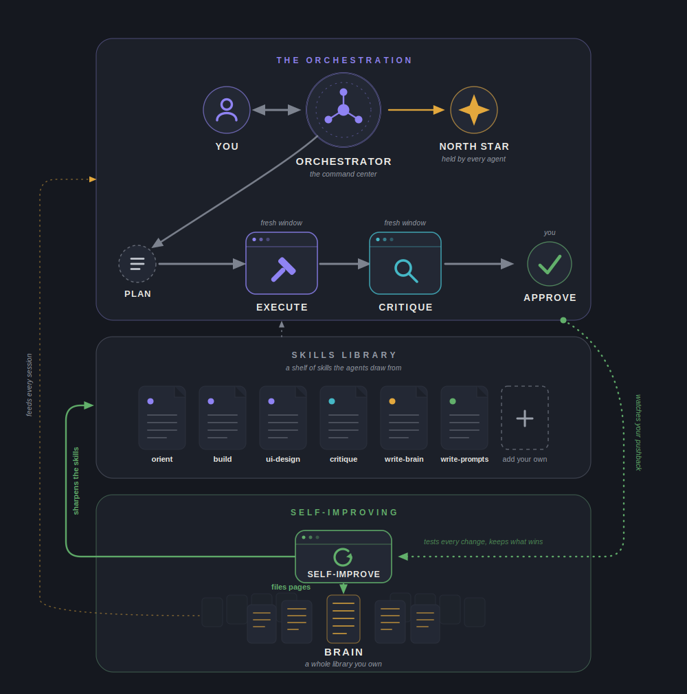

# Orient

**The self-improving AI system that understands you before it builds.**


We've all had this: you explain exactly what you want, the goal, the reasoning, the why, and the AI builds something else. It coded, but it never saw your vision. Orient fixes that at the root. It is a system where the AI **finally understands you** before anything is built, where real builds run through **orchestrated agents** in fresh windows, each **judged** against your vision, and where the whole thing is **self-improving**, so it gets better every session you use it. Orient runs inside Claude Code.



## The ways it breaks

Working with an AI agent goes wrong the same way for everyone.

- **It builds before it understands.** You give a request, it runs with a guess, and you hope.
- **You explain your vision perfectly, and it still builds something else.** You poured out the idea, the reasoning, the exact picture in your head. It kept the to-do item and dropped everything that mattered.
- **One tangent and the magic is gone.** You had reached a sharp, aligned understanding. You explored a side question, and now it's lost, and winning it back is what drains you.
- **It makes the calls that were yours.** The trade-offs where your judgment matters most get decided silently, in seconds.
- **It answers everything with a wall of text.** A thousand words of jargon for a question that needed one plain sentence, and your brain is tired before you're halfway through.
- **It forgets you.** Everything you taught it today, you will teach it again tomorrow.

Orient catches every one. **It understands you. It orchestrates. It improves itself.**

## How it works

### It finally understands you

Every AI system starts building. Orient starts by understanding.

It opens as a grounded conversation that **refuses** to take your request at face value: what you say first is a starting point, not a spec. It reads the **real code** before it asks you anything. Then it leans on your **reasoning**, because the why behind your words is what teaches it how you think. It never flattens your idea into "pick A, B, C, or D": it surfaces why A holds, why part of B holds, why C fails and for what reason. We call that the **orchestra of context**, and that reasoning is the prize.

Then comes the moment the whole system is built around: it says your intent back to you, **in your own words**, reflecting the **essence** of what you meant, not the literal thing you said. The bar is that the reflection **surprises you**, because it holds your vision as deeply as you do. And it does not just accept your idea. You **pressure-test it together**, through edge cases, sharper words, and better options, because you are both invested in the best goal, not your first one.

What you land on is the **North Star**: your vision in a few sentences, confirmed by you. Every agent downstream is judged against it.

And through all of it, Orient speaks the way the world's best communicators do: **the big picture first, then the details**. Once the picture is in your head, every detail falls into place on its own, like driving a road you know: nothing to decode, no energy spent, the conversation just flows. It listens the same way, because when you both hold the same picture, nothing gets lost between you. Plain words, no walls of text, because verbosity is how action dies.

### It orchestrates the build

Your conversation is the **orchestrator**, the command center. The building happens elsewhere: Orient sizes the work and delegates it to **sub-agents**, each in a **fresh context window** (a clean slate, nothing left over to confuse it), each with its own **skills** (its own how-to files).

- **Plan.** For a real build, Orient writes the route first: provable steps, each saying what to do and how you will know it is done.
- **Execute.** A fresh builder with no memory of the debate and no attachment to a first idea. It gets the North Star **verbatim**, pushes back if the plan does not hold up, and proves the work with its own eyes before reporting done.
- **Critique.** A second fresh agent judges the build before you ever see it, in two passes, never blended:
  1. **The vision.** Did it capture the North Star, whole, for the right person?
  2. **The code.** It runs the project's own checks and reads every changed line.

  A fail goes straight back to Execute with the exact defects, then gets re-judged.
- **Approve.** You say yes. The one call the system never makes for you.

A typo skips all of this and just gets done. The process sizes itself to the work.

### It improves itself

The more you use Orient, the less you have to explain.

A **self-improving agent** runs on its own in the background and looks for the moments you pushed back, because each correction is the exact gap between what the system thought you wanted and what you actually did. It turns them into two things:

- **Sharper skills.** It rewrites its own how-to files, tests the change against a real case, and keeps only what wins.
- **A brain.** A knowledge base about you and your work, kept as plain markdown files you own. Point it at your Obsidian vault if you have one.

Say a correction once and it holds. And you can **watch it work**: a one-page dashboard shows every skill it sharpened and every page it filed.

## Quick start

You need [Claude Code](https://claude.com/claude-code).

```bash
git clone https://github.com/abdnnasirr/orient.git
cd orient
node adapters/claude/install.mjs           # dry run: shows what it would link
node adapters/claude/install.mjs --apply   # symlinks agents + skills into ~/.claude
```

Add one line to your `~/.claude/CLAUDE.md` pointing at the overview, `@/path/to/orient/core/orient-overview.md`, and Orient orients on every request without being asked (`/orient` also triggers it explicitly). The two hooks are two small blocks you paste into one settings file, so the self-improver runs on its own (`hooks/README.md` shows exactly what to paste). Then just talk to it. Zero dependencies: plain Node and plain markdown, everything readable in the repo you just cloned.

## How it compares

Everything in this field is right on some points and wrong on others. Orient takes the right and leaves the wrong.

- **Grill-me (Matt Pocock)** is right that you should question the person before you build. But it walks a strict question tree, one question, one answer, and people do not think that way. Orient's conversation values your context and your reasoning instead of boxing you into options.
- **GSD** is right about the spine: discuss, plan, execute, verify, with a fresh agent for the build. Orient keeps that shape and puts real understanding in front of it.
- **Spec Kit** is right that a build should be held to a written standard. In Orient, that standard maintains itself.
- **Hermes Agent** is right that the system should grow with you, creating its own skills as it learns. But it is shaped for personal use over Telegram or Discord. Orient is built intentionally for both: personal or professional, one person or an entire team.

Nobody pairs the three: a system that understands you, orchestrated agents that build and judge, and a loop that improves itself. That pairing is Orient.

## Under the hood

The design decisions, said plainly.

- **Every agent runs in a fresh context window.** Your session never rots, and no build inherits a bias.
- **Everything is plain markdown you own.** No database, no hidden state. Open it, read it, grep it, version it.
- **Zero dependencies.** Plain Node and plain files. Clone it and it runs.
- **Skills load on demand.** The system carries only what the moment needs, so your tokens go to your work.
- **The self-improver never re-reads the transcript.** Each run picks up exactly where the last one left off, so cost stays flat no matter how long the session grows.
- **The mining runs on a lighter model.** Learning happens off the main line and does not eat your budget.
- **The core is walled.** The self-improving agent can sharpen skills and the brain, but it can never rewrite the system itself.

## The repo

```
orient/
  README.md
  LICENSE                     MIT
  core/
    orient-overview.md        the always-on context that makes the orchestrator orient first
  agents/
    execute.md                the builder, fresh clean window
    critique.md               the judge, read-only, fresh clean window
    self-improve.md           the autonomous improvement loop
  skills/
    orient/                   the grounded conversation (main thread)
    build/                    how to build like a veteran of the codebase
    build-intensive/          the deep mode for large or unfamiliar builds
    ui-design/                the craft for any screen
    technical-critique/       the code hunt for Critique's second pass
    write-prompts/            authors prompt and skill files
    test-prompts/             proves prompt changes against evals
    write-brain/              files durable knowledge into the brain
    clean-brain/              the brain's weekly health pass
  evals/
    README.md                 how proof cases work (your gold cases stay local, gitignored)
  hooks/
    README.md                 how to wire the hooks
    core-wall.mjs             the wall around the core files
    self-improve-trigger.mjs  fires the self-improver as sessions grow
    wall-unit.sh              the wall's test suite
    wall-proof.sh             the wall proven against a live run
    self-improve-unit.sh      the trigger's slicing and recovery, proven
  adapters/
    claude/install.mjs        symlinks agents + skills into ~/.claude (dry-run by default)
  surface/
    generate.mjs              builds your self-improver dashboard from its run log
```

## Status

This is v0.1.0, a living draft, refined in daily real use. The edges will keep moving; the five steps and the vocabulary are locked.

Verbs: Orient, Plan, Execute, Critique, Approve. Nouns: North Star, Plan. That is the whole vocabulary.

Orient is the contract between human intent and machine execution, turned into a process.

## License

MIT. Copyright 2026 Abdullah Nasir.
